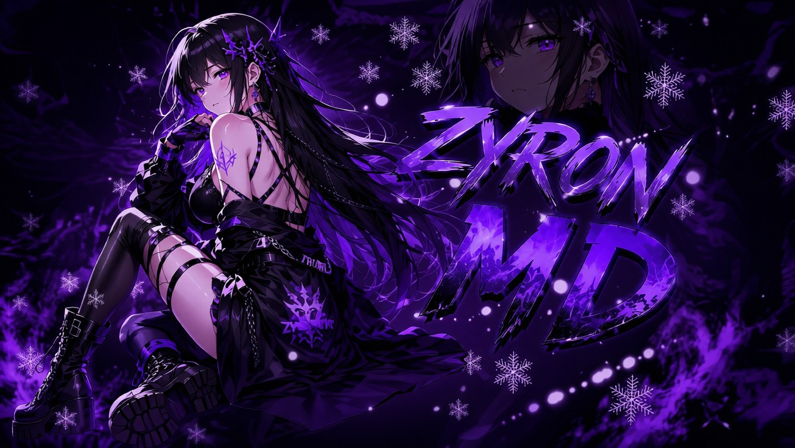

⚡ ZYRON-MD & ZYRON-AI ❤️‍🔥

   

---

❤️‍🔥 SOBRE O PROJETO

O Zyron-MD & Zyron-AI é uma automação completa para WhatsApp desenvolvida pela equipe Gzee Scripts Dev.

O projeto reúne:

- 🤖 Inteligência Artificial
- 🎮 Sistema RPG Completo
- 🏦 Banco e Economia
- 🐾 Sistema de Pets
- 🎣 Pesca
- ⛏️ Mineração
- 🏹 Caça
- 🚢 Batalha Naval
- 🛒 Loja
- 🏦 Leilões
- 📥 Downloaders
- 🛡️ Moderação
- 🎨 Menus Interativos

Tudo isso em um único bot.

---

🚀 INSTALAÇÃO

📦 Atualizar Pacotes

apt update -y
apt upgrade -y
pkg update -y
pkg upgrade -y

📥 Instalar Dependências

pkg install nodejs -y
pkg install nodejs-lts -y
pkg install ffmpeg -y
pkg install git -y
pkg install wget -y
pkg install tesseract -y

📁 Permitir Storage

termux-setup-storage

📂 Clonar Projeto

git clone https://github.com/GZEE-SCRIPTS-DEV/ZYRON-MD-ZYRON-AI

📦 Instalar Módulos

npm install --force --no-bin-links

▶️ Iniciar Bot

npm start

---

⚙️ CONFIGURAÇÃO

Abra o arquivo de configuração e edite:

{
  "NumberDono": "5519995729970",
  "prefix": "$",
  "NickDono": "GzeeScriptsDev",
  "NomeBot": "Zyron-MD",
  "NomeIA": "Zyron-AI"
}

Campos

Campo| Função
NumberDono| Número do proprietário
prefix| Prefixo dos comandos
NickDono| Nome do dono
NomeBot| Nome do bot
NomeIA| Nome da IA

---

🔗 CONECTANDO

Método Pairing Code

1. Inicie o bot
2. Digite seu número
3. Receba o código
4. Abra WhatsApp
5. Aparelhos Conectados
6. Conectar com código
7. Digite o código

---

🧠 SISTEMAS

❤️‍🔥 Zyron AI

- Conversa sem prefixo
- IA personalizada
- Memória própria
- Respostas inteligentes
- Modelos OpenRouter
- Groq API

---

🎮 Sistema RPG

- 🏦 Banco
- 💰 Economia
- 📈 XP
- 🏅 Níveis
- 🐾 Pets
- 🎣 Pesca
- ⛏️ Mineração
- 🏹 Caça
- 🚢 Batalha Naval
- 🎰 Cassino
- 🏦 Leilão
- 🛒 Loja

---

📥 Downloaders

- YouTube
- TikTok
- Instagram
- Spotify
- MediaFire
- Pinterest

---

🛡️ Moderação

- Antilink
- Antilink Hard
- Boas-vindas
- Sistema ADM
- Sistema Dono
- 
---

📊 RECURSOS

✅ IA Integrada

✅ Sistema RPG

✅ Banco

✅ Loja

✅ Leilão

✅ Pets

✅ Pesca

✅ Mineração

✅ Caça

✅ Cassino

✅ Batalha Naval

✅ Downloaders

✅ Menus Interativos

✅ Sistema Premium

---

⚠️ AVISO

Este projeto é destinado para estudos e automação.
Este projeto contém uma segurança de criptografia de Copyright, em caso de você mexer de forma que tirei a autorização do dono o bot pode ser totalmente desativado para sua plataforma.
O uso incorreto pode resultar em punições da plataforma WhatsApp.

A equipe Zyron não se responsabiliza por:

- Banimentos
- Mau uso
- Spam
- Violações dos Termos

Use com responsabilidade.

---

👑 DESENVOLVEDORES

👑 GZEE SCRIPTS DEV

Desenvolvedor Principal

❤️‍🔥 GASPAR DEV

Co-Desenvolvedor

 
---

🌐 COMUNIDADE

Canal Oficial

https://chat.whatsapp.com/LqX13WIT2GOLXaSNY90Y4m?s=cl&p=a&mlu=3

---

